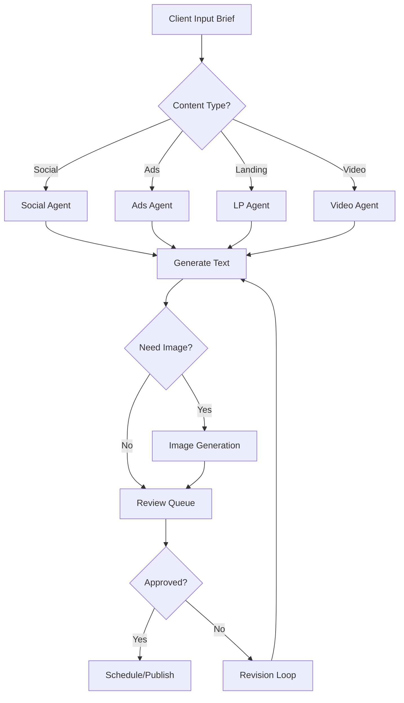

# 🚀 AI Content Agency Blueprint

## Tổng quan dự án

Xây dựng **AI Content Agency** chuyên biệt cho một ngách thị trường cụ thể, cung cấp giải pháp content toàn diện bao gồm:
- Content Social Media
- Content Ads (Facebook, Google, TikTok...)
- Landing Page
- Video Ads/Scripts
- Hình ảnh Marketing

---

## 📊 Phân tích tính khả thi

### ✅ CÓ THỂ LÀM TỐT (70-90% hiệu quả như người)

| Loại content | Khả năng AI | Ghi chú |
|-------------|-------------|---------|
| **Copywriting Ads** | 90% | ChatGPT, Claude xuất sắc ở đây |
| **Social Post (Text)** | 85% | Có thể tự động hóa hoàn toàn |
| **Landing Page Copy** | 85% | Cần input về sản phẩm/dịch vụ |
| **Email Marketing** | 90% | AI làm rất tốt |
| **SEO Content** | 80% | Cần kiểm tra fact-check |
| **Video Script** | 80% | Tốt cho short-form |
| **Image Generation** | 75% | Midjourney, DALL-E, Flux |
| **Video từ Script** | 70% | HeyGen, Synthesia, Runway |

### ⚠️ CẦN HUMAN-IN-THE-LOOP

| Loại công việc | Lý do |
|---------------|-------|
| Strategy tổng thể | Cần hiểu sâu business |
| Brand Voice tuning | Điều chỉnh ban đầu |
| Crisis Management | Nhạy cảm, cần judgment |
| Creative Direction | Ý tưởng đột phá |
| Quality Control cuối | Đảm bảo không lỗi |

---

## 🏗️ Kiến trúc hệ thống đề xuất

```
┌─────────────────────────────────────────────────────────────────┐
│                    CLIENT DASHBOARD                              │
│  (Input: Brand info, Product, Target audience, Campaign brief)  │
└─────────────────────────────────────────────────────────────────┘
                              │
                              ▼
┌─────────────────────────────────────────────────────────────────┐
│                    ORCHESTRATION LAYER                          │
│         (n8n / Make / Custom Python Backend)                    │
└─────────────────────────────────────────────────────────────────┘
                              │
          ┌───────────────────┼───────────────────┐
          ▼                   ▼                   ▼
┌─────────────────┐ ┌─────────────────┐ ┌─────────────────┐
│  TEXT AGENTS    │ │  IMAGE AGENTS   │ │  VIDEO AGENTS   │
│                 │ │                 │ │                 │
│ • Claude/GPT    │ │ • Midjourney    │ │ • HeyGen        │
│ • Social Copy   │ │ • DALL-E 3     │ │ • Runway        │
│ • Ads Copy      │ │ • Flux          │ │ • Pika          │
│ • Landing Page  │ │ • Leonardo      │ │ • Synthesia     │
└─────────────────┘ └─────────────────┘ └─────────────────┘
                              │
                              ▼
┌─────────────────────────────────────────────────────────────────┐
│                    REVIEW & APPROVAL                            │
│              (Human QC hoặc AI Quality Check)                   │
└─────────────────────────────────────────────────────────────────┘
                              │
                              ▼
┌─────────────────────────────────────────────────────────────────┐
│                    DELIVERY / SCHEDULING                        │
│    (Auto-post to Social, Export assets, Calendar scheduling)   │
└─────────────────────────────────────────────────────────────────┘
```

---

## 📋 CÁC BƯỚC XÂY DỰNG CHI TIẾT

### Phase 1: Foundation (Tuần 1-2)

#### 1.1 Chọn Niche Market
```
Tiêu chí chọn niche tốt:
├── Có pain point rõ ràng về content
├── Sẵn sàng chi trả (B2B hoặc SME có budget)
├── Content có pattern lặp lại (dễ template hóa)
├── Ít yêu cầu creative đột phá
└── Có data/case study để train

Ví dụ niche tiềm năng:
• Bất động sản (BĐS)
• F&B / Nhà hàng / Cafe
• Spa / Thẩm mỹ viện
• Giáo dục / Khóa học online
• E-commerce (Fashion, Mỹ phẩm)
• Phòng khám / Nha khoa
• Gym / Fitness
```

#### 1.2 Xây dựng Brand Bible Template
```markdown
Mỗi client cần cung cấp:
1. Thông tin doanh nghiệp
   - Tên, slogan, giá trị cốt lõi
   - USP (Unique Selling Point)
   - Tone of voice (chuyên nghiệp/trẻ trung/thân thiện...)
   
2. Sản phẩm/Dịch vụ
   - Danh sách sản phẩm
   - Tính năng & lợi ích
   - Giá & promotion
   
3. Khách hàng mục tiêu
   - Demographics
   - Pain points
   - Desires & motivations
   
4. Đối thủ cạnh tranh
   - Top 3-5 đối thủ
   - Điểm khác biệt
   
5. Assets có sẵn
   - Logo, màu sắc brand
   - Hình ảnh sản phẩm
   - Testimonials
```

### Phase 2: AI Agent Development (Tuần 3-6)

#### 2.1 Social Content Agent
```python
# Prompt Template cho Social Content
SOCIAL_AGENT_PROMPT = """
Bạn là Content Creator chuyên nghiệp cho ngành {niche}.

BRAND CONTEXT:
{brand_bible}

NHIỆM VỤ: Tạo {số_lượng} bài post cho {platform}

YÊU CẦU:
- Tone: {tone_of_voice}
- Mục tiêu: {objective} (awareness/engagement/conversion)
- Hashtags phù hợp ngành
- CTA rõ ràng
- Độ dài: {length_guide}

OUTPUT FORMAT:
1. Hook (dòng đầu tiên gây chú ý)
2. Body (nội dung chính)
3. CTA (kêu gọi hành động)
4. Hashtags (5-10 tags)
5. Best posting time suggestion
"""
```

#### 2.2 Ads Copy Agent
```python
ADS_AGENT_PROMPT = """
Bạn là Performance Copywriter với 10 năm kinh nghiệm.

CAMPAIGN BRIEF:
- Sản phẩm: {product}
- Mục tiêu: {campaign_goal}
- Platform: {platform}
- Budget: {budget_range}
- Đối tượng: {target_audience}

TẠO CÁC VARIATIONS:
1. Primary Text (3 versions)
2. Headlines (5 versions)
3. Descriptions (3 versions)

ÁP DỤNG FRAMEWORKS:
- AIDA (Attention-Interest-Desire-Action)
- PAS (Problem-Agitate-Solution)
- BAB (Before-After-Bridge)

OUTPUT: JSON format để dễ import vào Ads Manager
"""
```

#### 2.3 Landing Page Agent
```python
LANDING_PAGE_PROMPT = """
Bạn là Conversion Rate Optimization Expert.

TẠO LANDING PAGE COPY:

Sections cần có:
1. Hero Section
   - Headline (USP chính)
   - Subheadline
   - CTA button text
   
2. Problem Section
   - 3 pain points của khách hàng
   
3. Solution Section
   - Cách sản phẩm giải quyết
   
4. Features/Benefits
   - 4-6 tính năng chính
   - Benefit của mỗi tính năng
   
5. Social Proof
   - Testimonial templates
   - Trust badges suggestions
   
6. FAQ
   - 5-7 câu hỏi thường gặp
   
7. Final CTA
   - Urgency element
   - Risk reversal (guarantee)
"""
```

#### 2.4 Video Script Agent
```python
VIDEO_SCRIPT_PROMPT = """
Bạn là Video Script Writer cho {platform} (TikTok/Reels/YouTube Shorts).

BRIEF:
- Độ dài: {duration} giây
- Style: {style} (talking head/b-roll/animation)
- Hook type: {hook_type}

STRUCTURE:
[0-3s] HOOK - Gây chú ý ngay lập tức
[3-15s] PROBLEM - Nêu vấn đề/pain point  
[15-25s] SOLUTION - Giới thiệu giải pháp
[25-28s] PROOF - Social proof/kết quả
[28-30s] CTA - Kêu gọi hành động

OUTPUT:
- Script chi tiết từng giây
- Visual suggestions
- Text overlay suggestions
- Music/sound recommendations
"""
```

### Phase 3: Integration & Automation (Tuần 7-10)

#### 3.1 Tech Stack đề xuất

```yaml
Backend:
  - Python FastAPI hoặc Node.js
  - PostgreSQL (lưu brand data, content history)
  - Redis (caching, queue)

AI Services:
  - OpenAI GPT-4o (text generation)
  - Anthropic Claude (long-form, analysis)
  - Midjourney API (via Discord bot)
  - Replicate (Flux, SDXL)
  - ElevenLabs (voiceover)
  - HeyGen/Synthesia (avatar video)

Automation:
  - n8n (open-source, self-hosted)
  - Make.com (no-code alternative)
  - Zapier (simple integrations)

Frontend:
  - Next.js hoặc Nuxt.js
  - Tailwind CSS
  - Shadcn/ui components

Deployment:
  - Vercel/Railway (frontend)
  - AWS/GCP (backend)
  - Cloudflare R2 (media storage)
```

#### 3.2 Workflow tự động



### Phase 4: Dashboard & Client Portal (Tuần 11-14)

#### 4.1 Features cần có

```
CLIENT DASHBOARD:
├── Onboarding Wizard
│   ├── Brand info input
│   ├── Product catalog
│   └── Target audience setup
│
├── Content Calendar
│   ├── Monthly view
│   ├── Drag & drop scheduling
│   └── Multi-platform sync
│
├── Content Generation
│   ├── Quick generate (1-click)
│   ├── Batch generate
│   └── Custom prompt
│
├── Asset Library
│   ├── All generated images
│   ├── Video exports
│   └── Copy variations
│
├── Analytics (Phase 2)
│   ├── Engagement metrics
│   ├── Best performing content
│   └── A/B test results
│
└── Settings
    ├── Brand guidelines
    ├── Approval workflow
    └── Team members
```

### Phase 5: Launch & Scale (Tuần 15+)

#### 5.1 Go-to-market Strategy

```
PRICING MODEL:

Tier 1 - Starter ($299/tháng)
├── 30 social posts/tháng
├── 10 ad variations/tháng
├── 5 hình ảnh AI/tháng
└── Email support

Tier 2 - Growth ($599/tháng)
├── 60 social posts/tháng
├── 30 ad variations/tháng
├── 20 hình ảnh AI/tháng
├── 2 video scripts/tháng
└── Priority support

Tier 3 - Scale ($1,299/tháng)
├── Unlimited social posts
├── Unlimited ad variations
├── 50 hình ảnh AI/tháng
├── 5 video scripts/tháng
├── 1 landing page/tháng
├── Dedicated account manager
└── Monthly strategy call
```

---

## 🌟 Case Studies & Mô hình tham khảo

### Các công ty đã làm thành công:

#### 1. **Jasper.ai** (USA)
- Valuation: $1.5B
- Focus: AI copywriting
- Model: SaaS subscription

#### 2. **Copy.ai** (USA)  
- Focus: Marketing copy
- 10M+ users
- Freemium model

#### 3. **Lately.ai** (USA)
- Focus: Social media AI
- Repurpose long content → social posts
- Enterprise clients

#### 4. **Pencil** (Singapore)
- Focus: AI ad creative
- Generate video ads từ assets
- Pay-per-use model

#### 5. **Phrasee** (UK)
- Focus: Email/push copy
- Enterprise brands (Domino's, eBay)
- Performance-based pricing

### Mô hình Agency hybrid thành công:

#### **VidIQ + Human (Hybrid Model)**
```
AI làm:
- Research keywords
- Generate title ideas
- Suggest thumbnails
- Write descriptions

Human làm:
- Final selection
- Brand alignment
- Creative direction
```

---

## ⚠️ Rủi ro & Cách giảm thiểu

| Rủi ro | Mức độ | Giải pháp |
|--------|--------|-----------|
| AI hallucination (thông tin sai) | Cao | Human QC layer, fact-check prompts |
| Brand voice không nhất quán | Trung bình | Fine-tune với examples, feedback loop |
| Khách hàng kỳ vọng quá cao | Cao | Onboarding rõ ràng, demo trước |
| Đối thủ copy model | Trung bình | Focus vào niche, build relationships |
| AI providers thay đổi giá/API | Trung bình | Multi-provider strategy |
| Legal issues (copyright AI art) | Thấp-TB | Disclosure, terms of service |

---

## 🎯 Action Plan - 90 ngày đầu tiên

### Tháng 1: Foundation
- [ ] Chọn niche cụ thể (1 tuần research)
- [ ] Xây dựng Brand Bible template
- [ ] Setup tech stack cơ bản
- [ ] Phát triển 2 agents đầu tiên (Social + Ads)
- [ ] Test với 2-3 pilot clients (free/giảm giá)

### Tháng 2: Build & Test
- [ ] Hoàn thiện thêm agents (Landing, Video)
- [ ] Xây dựng dashboard MVP
- [ ] Thu thập feedback từ pilot clients
- [ ] Iterate và cải thiện prompts
- [ ] Chuẩn bị pricing & packaging

### Tháng 3: Launch
- [ ] Soft launch với giá early-bird
- [ ] Content marketing (case studies)
- [ ] Outreach đến target clients
- [ ] Setup customer support
- [ ] Thu first 10 paying customers

---

## 💡 Tips thực chiến

### 1. Prompt Engineering là chìa khóa
```
Đầu tư 80% effort vào việc:
- Viết system prompts chi tiết
- Tạo few-shot examples tốt
- Build feedback loop để improve
```

### 2. Human-in-the-loop strategy
```
Giai đoạn đầu: 30% AI, 70% Human review
Giai đoạn sau: 70% AI, 30% Human QC
Ultimate goal: 90% AI, 10% Human oversight
```

### 3. Niche down mạnh mẽ
```
❌ "AI Content cho mọi ngành"
✅ "AI Content cho ngành F&B tại Việt Nam"
✅ "AI Content cho Spa & Beauty"
```

### 4. Value-based pricing
```
Không bán "số lượng content"
Bán "giải pháp tiết kiệm 70% chi phí content"
Bán "đội ngũ content 24/7 không nghỉ phép"
```

---

## 📞 Next Steps

1. **Quyết định niche** - Bạn muốn focus vào ngành nào?
2. **Validate idea** - Phỏng vấn 5-10 business trong niche
3. **Build MVP** - Bắt đầu với 1 loại content trước
4. **Find pilot clients** - 3-5 clients test miễn phí
5. **Iterate** - Cải thiện dựa trên feedback

---

*Document created: December 2024*
*Version: 1.0*
